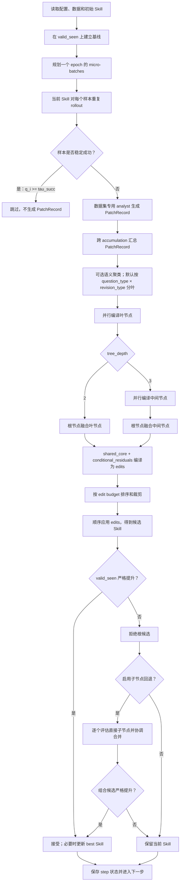

# PatchTree-v4：当前代码训练流程说明

> 本文描述的是仓库**当前可执行代码**，而不是历史设计稿。这里的
> “PatchTree-v4”表示本次代码快照对应的方法版本；为兼容旧产物，部分源码文件、
> 缓存键和 artifact 名称仍保留 `type_guided_v2` / `v2.x` 字样。

## 1. 方法概览

PatchTree-v4 不直接让模型重写整份 Skill。它先在训练样本上重复执行当前 Skill，
只从稳定失败或表现不稳定的样本中提取局部修正，再将局部修正组织成树，最后把树
编译为一个可执行 Patch。候选 Skill 必须在独立选择集上严格优于当前 Skill，才会
进入下一训练步。

当前主链路可以概括为：



这条链路中有两个模型角色：

| 角色 | 主要职责 |
| --- | --- |
| target model | 使用当前 Skill 完成数据集任务，产生 rollout、答案、轨迹和分数 |
| optimizer model | 分析失败、生成 PatchRecord、聚类、合并树节点、排序 edits，以及可选地决定 edit budget |

两者可以使用不同后端。例如 optimizer 使用远程 DeepSeek 兼容接口，target 使用本地
vLLM 部署的 Qwen。

## 2. 入口、配置与运行对象

训练入口是 `scripts/cli/train.py`。它依次完成：

1. 读取数据集 YAML，并递归展开 `_base_`。
2. 将 `model/train/gradient/optimizer/evaluation/env` 等分区配置扁平化为 trainer 使用的键。
3. 用命令行参数覆盖 YAML。
4. 注册并创建数据集 `EnvAdapter`。
5. 若未指定 `out_root`，生成
   `outputs/patchtree_{env}_{optimizer_model}_{timestamp}`。
6. 创建 `PatchTreeTrainer(cfg, adapter)` 并调用 `train()`。

当前仓库实际具备实现的六个环境是：

- `alfworld`
- `docvqa`
- `livemathematicianbench`
- `officeqa`
- `searchqa`
- `spreadsheetbench`

`EnvAdapter` 统一了各数据集的差异。trainer 只依赖以下抽象能力：初始化环境、取得
dataloader、把一个 `BatchSpec` 建成训练/评估环境、执行 rollout，以及读取任务类型。

### 2.1 默认训练配置

`configs/_base_/default.yaml` 定义的关键默认值如下：

| 配置 | 默认值 | 含义 |
| --- | ---: | --- |
| `num_epochs` | 4 | 训练 epoch 数 |
| `batch_size` | 40 | 每个 micro-batch 的样本数 |
| `accumulation` | 1 | 每个更新步累计的 micro-batch 数 |
| `learning_rate` | 4 | 每步最多保留的 edit 数，不是梯度学习率 |
| `min_learning_rate` | 2 | 衰减调度下 edit budget 的下限 |
| `lr_scheduler` | `cosine` | edit budget 调度方式 |
| `type_guided_rollout_repeats` | 3 | 每个样本的重复 rollout 次数 |
| `type_guided_tau_succ` | 1.0 | 稳定成功阈值 |
| `type_guided_min_support` | 2 | 一个叶组至少需要的支持数 |
| `type_guided_max_leaf_groups` | 8 | 每步最多保留的叶组数 |
| `type_guided_tree_depth` | 2 | 默认树为 leaf → root |
| `type_guided_clustering` | false | 默认不调用 LLM 做全局聚类 |
| `type_guided_tail_bank` | false | 默认不启用跨步 tail 恢复 |
| `use_gate` | true | 启用验证门控 |
| `sel_env_num` | 0 | 使用完整 `valid_seen` 选择集 |
| `eval_test` | true | 训练结束评估测试集 |

因此，在不覆盖配置时，PatchTree-v4 的实际行为是：三次重复 rollout、按开放类型对
分组、二层树、叶节点并行融合、根节点融合、cosine edit budget、hard-score 验证门控，
并在根候选失败后尝试直接子节点回退。

## 3. 数据划分、batch 与 step

### 3.1 三类数据划分

统一 dataloader 使用以下逻辑名称：

| 训练语义 | dataloader split | 用途 |
| --- | --- | --- |
| 训练集 | `train` | 产生失败证据和 PatchRecord |
| 选择集 | `valid_seen`，内部映射到 `val` | 门控、模型选择和 best Skill 更新 |
| 测试集 | `valid_unseen`，内部映射到 `test` | 只在训练结束后报告泛化结果 |

`split_mode=ratio` 时，dataloader 从源数据确定性地产生 train/val/test；
`split_mode=split_dir` 时直接读取预先划分的数据。

### 3.2 每个 epoch 的批次规划

trainer 首先解析训练集大小。`train_size=0` 表示从 dataloader 推断；若配置了正数且
与可推断大小不一致，代码会报错，防止训练步数与真实数据漂移。

每个 epoch 的更新步数为：

\[
N_{step}=\left\lceil\frac{N_{train}}
{\text{batch\_size}\times\text{accumulation}}\right\rceil.
\]

需要规划的 micro-batch 数为：

\[
N_{micro}=N_{step}\times\text{accumulation}.
\]

`plan_train_epoch()` 用 `seed + epoch * 1000` 洗牌一次，然后依次切出这一 epoch 的
所有 micro-batch。对于极小数据集，末尾空 micro-batch 可以复用洗牌后前缀，保证
既定的 accumulation 结构完整。

需要注意：`accumulation` 只表示“汇总多少个 micro-batch 的 PatchRecord 后更新一次
Skill”，不存在神经网络意义上的梯度累积。

## 4. 初始化、恢复与基线

trainer 启动后会分别配置 optimizer backend 和 target backend，并读取 `skill_init`。
若没有初始 Skill 文件，初始内容为空字符串。

### 4.1 断点恢复

恢复顺序是：

1. 优先读取 `runtime_state.json`；
2. 若不存在，再尝试从 `history.json` 恢复；
3. 恢复 current Skill、best Skill、分数、best step、global step 和 scheduler step；
4. 首次运行保存 `skills/skill_v0000.md`。

恢复的目标是从下一个 global step 继续，而不是重新执行已完成的更新。

### 4.2 基线验证

在第一次更新前，当前 Skill 会在 `valid_seen` 上执行一次。`compute_score()` 返回：

- `hard`：每个样本是否完全成功的平均值；
- `soft`：数据集定义的部分得分平均值。

门控可以选择：

\[
s=\begin{cases}
hard,& metric=hard,\\
soft,& metric=soft,\\
(1-w)hard+w\,soft,& metric=mixed.
\end{cases}
\]

默认使用 `hard`。验证结果按 Skill 内容的 hash 缓存，后续遇到完全相同的 Skill 时
可以直接复用。

## 5. 单个训练 step 的完整流程

一个更新 step 包含若干 micro-batch。每个 micro-batch 单独 rollout 和生成
PatchRecord；所有 micro-batch 完成后，才统一建树、生成和验证候选 Skill。

### 5.1 重复 rollout：区分稳定成功与偶然成功

对一个训练样本 \(i\) 重复执行 \(R\) 次，定义：

\[
q_i=\frac{1}{R}\sum_{r=1}^{R}\mathbb{1}
[\text{rollout}_{i,r}\text{ 成功}].
\]

代码按 `q_i` 将样本分为：

| 条件 | 状态 | 后续处理 |
| --- | --- | --- |
| `q_i >= tau_succ` | stable success | 不生成 PatchRecord |
| `q_i == 0` | failure | 交给 analyst 分析 |
| `0 < q_i < tau_succ` | unstable | 交给 analyst 分析 |

默认 `R=3` 且 `tau_succ=1.0`，因此只有三次全成功才会被过滤。一次或两次成功仍被
视为不稳定，因为它通常揭示了 Skill 的条件、边界或执行步骤不够明确。

#### list-backed 环境的批量加速

若训练环境底层是 `list[dict]`，trainer 会先把 `(sample, repeat)` 展平为一个大列表，
一次提交给 adapter：

```text
s1, s2
  × repeat=3
→ s1::repeat0, s1::repeat1, s1::repeat2,
  s2::repeat0, s2::repeat1, s2::repeat2
```

重复项临时使用不同 prediction id，避免轨迹文件互相覆盖；rollout 完成后再恢复原始
sample id 进行分组。不能展平的环境则按 repeat 分多次调用 rollout。

每个样本第一轮 rollout 同时作为该 micro-batch 的训练 hard/soft 统计；其余轮次
只参与稳定性判断和 PatchRecord 分析。

### 5.2 从失败证据生成 PatchRecord

`generate_patch_records()` 先按原始 sample id 聚合重复结果，并读取相应轨迹。输入给
analyst 的证据包括：

- 当前 Skill；
- sample id；
- `q_i` 与 failure/unstable 状态；
- 各次 rollout 的答案、hard/soft、失败原因、参考信息等紧凑字段；
- 各次执行轨迹。

为控制上下文，长文本字段会截断。若候选样本超过
`type_guided_max_patch_records`，代码优先保留 unstable 样本，再按 rollout 数和 id
排序截断。这里优先 unstable，是因为同一题有时成功、有时失败，通常能更直接暴露
当前规则缺少的适用条件。

analyst 输出经校验、补充编号后的最终精简结构为：

```json
{
  "record_id": "R0001",
  "question_type": "...",
  "revision_type": "...",
  "repair_signature": "...",
  "condition": "...",
  "boundary": "...",
  "patch": {
    "op": "append | insert_after | replace | delete",
    "target": "...",
    "content": "..."
  }
}
```

字段语义如下：

| 字段 | 作用 |
| --- | --- |
| `record_id` | trainer 按稳定顺序生成的本步唯一编号，不由模型生成 |
| `question_type` | 题目/任务形态，用作默认分叶信号 |
| `revision_type` | 所需修正机制，用作默认分叶信号 |
| `repair_signature` | 更具体的可复用失败模式，供聚类和中间层规划参考 |
| `condition` | 规则应该在什么情况下触发 |
| `boundary` | 哪些相似情况不应套用这条规则 |
| `patch` | 对当前 Skill 的一个原子编辑 |

除 `record_id` 外，其余六个语义字段由 analyst 模型生成，再由代码做结构校验。
`question_type` 和 `revision_type` 因而仍是开放词表，但会被清洗为稳定 slug；patch 的
op、必需的 target/content、condition 和 repair signature 不合格时，整条记录会被拒绝。

`q_i`、failure/unstable 状态和原始 evidence 不写入最终 PatchRecord。底层
prediction/trajectory 文件仍留在 rollout 目录；stable-success 列表会保存 `q_i`，但
当前 candidate 的 `q_i` 与 failure/unstable 标签只在 analyst 调用时使用，没有完整写回
step artifact。因此 PatchRecord 保持了建树所需的最小执行契约，但若要对候选失败做
逐条离线复盘，目前需要结合原始 rollout 文件，诊断信息还不是完全自包含的。

analyst 也可以返回 `no_patch`。这表示当前失败不能由可靠、可泛化的 Skill 修正解释，
从而避免把格式噪声、环境错误或单题答案写入 Skill。

### 5.3 每个数据集使用自己的类型 few-shot

代码会优先加载当前环境的 `type_guided_patch_record.md`，不存在时才使用通用 prompt。
类型表无需拆成“共享类型”和“数据集特定类型”：每个 prompt 可以直接复用适合的
通用类型，同时加入本数据集最常见的修正类型和贴近任务的 few-shot。

| 数据集 | few-shot 重点 |
| --- | --- |
| SearchQA | 证据选择、实体消歧、最小答案跨度 |
| DocVQA | 页面区域定位、邻近字段绑定、转录与归一化 |
| LiveMath | 量词/假设、强弱条件、等式与选项对应 |
| OfficeQA | 文件缩小、证据定位、时间口径、操作数与计算 |
| SpreadsheetBench | workbook/sheet/range、公式、样式和保存后验证 |
| ALFWorld | 探索、循环、动作前置条件、库存/电器状态和目标完成 |

每套 prompt 当前都包含三个示例，并至少覆盖一个“不应生成 patch”的情形。

### 5.4 跨 micro-batch 汇总

同一 step 的所有 micro-batch 完成后，trainer 会：

1. 拼接 PatchRecord；
2. 重新编号，避免不同 micro-batch 的 `record_id` 冲突；
3. 汇总 rollout、analyst、cache 和耗时信息；
4. 若没有任何有效 PatchRecord，跳过本步更新。

因此，建树看见的是整个 update step 的失败分布，而不是单个 micro-batch 的局部视图。

## 6. PatchRecord 如何变成树

### 6.1 可选的全局语义聚类

当 `type_guided_clustering=true` 时，optimizer 会一次查看本步全部 PatchRecord，规划
全局 cluster。主要兼容信号是：

1. `repair_signature`；
2. `condition`；
3. `boundary`；
4. `question_type` 和 `revision_type` 作为软信号。

聚类结果必须让每条记录恰好归属一个 cluster，并满足 cluster 最大大小。模型遗漏的
记录会按 `repair_signature` 进入确定性 fallback cluster。

当 clustering 关闭时，代码仍会生成一个便于观测的确定性 signature-cluster
artifact，但它**不参与实际分叶**。默认实际叶键仍是：

```text
(question_type, revision_type)
```

### 6.2 原子 Patch 转换

每个 PatchRecord 被转换成一个 failure patch，其中只有一条 edit，同时附加：

- question/revision type；
- `source=failure`；
- `support_count=1`；
- sample/record id；
- repair signature、condition、boundary；
- 可选 cluster 元数据。

随后这些 failure patches 进入 `build_patchtree()`。

### 6.3 分叶、支持度过滤与上限

开启 clustering 时按 cluster id 分叶；关闭时按 question/revision type 对分叶。
支持度优先按不同 sample id 计数，避免同一训练样本重复贡献虚假支持。

叶组按支持度降序排列，然后依次执行：

1. 丢弃 `support_count < min_support` 的组；
2. 最多保留 `max_leaf_groups` 个组；
3. 记录每个丢弃组的原因。

默认 clustering 关闭且 `low_support_fallback=true`。如果所有组都低于最小支持度，
代码仍保留排序第一的组，使小 batch 不会永远无法更新。开启 LLM clustering 后该
fallback 关闭，低支持 cluster 可以全部被丢弃。

## 7. 节点语义：shared_core + conditional_residuals

叶节点、中间节点和根节点使用同一语义契约：

```json
{
  "reasoning": "...",
  "shared_core": {
    "condition": "...",
    "boundary": "...",
    "source_child_ids": ["..."],
    "patch": {
      "op": "append | insert_after | replace | delete",
      "target": "...",
      "content": "..."
    }
  },
  "conditional_residuals": [
    {
      "condition": "...",
      "boundary": "...",
      "source_child_ids": ["..."],
      "patch": {
        "op": "append | insert_after | replace",
        "target": "...",
        "content": "..."
      }
    }
  ],
  "preserved_constraints": {"child_id": ["..."]},
  "unresolved_conflicts": []
}
```

它表达的是“共享机制 + 条件个性”：

- `shared_core` 只保留多个子节点真正共同的修正机制；
- `conditional_residuals` 保留只对某类题、某种证据形态或某个操作阶段成立的差异；
- `condition` 决定何时启用；
- `boundary` 防止规则扩张到相似但不适用的情形；
- `source_child_ids` 记录该规则从哪些孩子抽象而来。

这不是只用于解释的中间表示。`shared_core` 和每一条有效 residual 都会被编译成最终
Skill patch 中的普通 edit：

```text
When {condition}:

{content}

Do not apply this rule when {boundary}.
```

没有 condition 时不会添加 `When ...` 前缀；没有 boundary 时不会添加排除句。
residual 必须有明确 condition，且不能执行条件化 delete。`preserved_constraints` 和
`unresolved_conflicts` 只作为可审计元数据保存，不会直接铺入 Skill。

若节点 LLM 调用失败或输出不合法：

- 叶节点退化为保留该组的原始 edits；
- 中间/根节点退化为拼接子节点 edits。

因此，合并失败不会无声丢掉已通过结构校验的底层修正。

## 8. 树深度与融合顺序

代码支持的有效深度是 2 或 3；更大的值会被限制到 3。

### 8.1 深度 2：leaf → root

1. 每个保留叶组独立调用 optimizer 编译叶节点；
2. 多个叶节点可以通过 `type_guided_leaf_merge_workers` 并行；
3. 根节点读取所有叶 patch，提取跨叶共享机制并保留条件差异；
4. 根节点编译结果成为候选 patch。

### 8.2 深度 3：leaf → mid → root

1. 先并行生成叶节点；
2. optimizer 全局规划叶节点到 mid group 的分配；
3. 每个叶节点必须恰好进入一个 mid group；遗漏项进入确定性 singleton fallback；
4. 多个 mid group 通过 `type_guided_mid_merge_workers` 并行编译；
5. 根节点融合所有 mid patch。

如果 mid planner 调用失败，确定性 fallback 会按
`(revision_type, repair_signature)` 组织中间组。若只有一个叶节点，则没有必要增加
中间层，根节点直接以叶节点为孩子。

树深度描述的是**语义合并层级**，不是连续多步修改 Skill。无论深度为 2 还是 3，
最终都先编译成一个根 patch，再一次性应用到当前 Skill。

## 9. Edit budget、排序与候选 Skill

### 9.1 Edit budget

树根可能产生多条 edits。`learning_rate` 在本项目中表示每步最多执行多少条 edit。
它不是可微优化里的数值步长。

固定控制模式下，scheduler 根据 global step 返回预算：

- `constant`：保持上限；
- `linear`：线性衰减至下限；
- `cosine`：余弦衰减至下限。

`lr_control_mode=autonomous` 时，optimizer 会读取当前 Skill、候选 edits、本步 rollout
得分以及 step buffer，自主返回非负预算；非法输出回退为 0，并限制在可用 edit 数内。

### 9.2 LLM 排序

若根 patch 的 edit 数不超过预算，直接保留；否则 `rank_and_select()` 要求 optimizer
按系统性影响、互补性、可泛化性和可执行性选择原有 edit 的索引。它不能在此阶段
改写 edit。模型返回非法时，代码确定性地保留前 N 条。

预算为 0 或排序后没有 edit 时，本步跳过，不产生候选 Skill。

### 9.3 顺序应用 Patch

保留的 edits 按当前顺序逐条应用：

| op | 行为 |
| --- | --- |
| `append` | 追加到 Skill 末尾 |
| `insert_after` | 在 target 所在行后插入；target 不存在时退化为 append |
| `replace` | 只替换首次出现的 target；target 不存在则跳过 |
| `delete` | 只删除首次出现的 target；target 不存在则跳过 |
| 未知 op | 跳过 |

trainer 会保存逐 edit apply report，因此可区分“被选择但未真正应用”和“成功应用”。

## 10. 验证门控

候选 Skill 在 `valid_seen` 上评估，并与 current/best 状态比较。门控使用严格大于：

| 条件 | 动作 |
| --- | --- |
| `candidate > current` 且 `candidate > best` | `accept_new_best` |
| `candidate > current` 但不超过 best | `accept` |
| `candidate <= current` | `reject` |

分数相等也会拒绝，避免 Skill 在没有验证收益时不断变长。接受后 candidate 成为下一步
的 current Skill；只有超过历史 best 时才更新 best Skill 和 best step。

若 `use_gate=false`，代码仍会执行候选验证以记录指标，但随后强制接受候选。这个选项
适合消融，不适合作为默认训练设置。

## 11. 根候选失败后的子节点回退

根节点可能因为过度抽象或多个机制互相干扰而失败。启用
`type_guided_leaf_fallback` 时，trainer 不会立即丢弃整棵树，而会评估根的直接孩子：

- 深度 2：直接孩子是 leaf patch；
- 深度 3：直接孩子是 mid patch。

回退流程是：

1. 可选地按支持度只取 top-K；默认评估全部直接孩子；
2. 分别把每个孩子应用到同一个 current Skill；
3. 在选择集上独立评估；
4. 只保留分数大于 `current_score + tau_child` 的孩子；
5. 协调这些孩子的 edits；
6. 再应用组合 patch，并走一次正常验证门控。

协调方式有三种：

| 模式 | 行为 |
| --- | --- |
| `off` | 直接拼接所有孩子 edits |
| `deterministic` | 按 `(op, target, content)` 精确去重，默认方式 |
| `llm_select` | 让 optimizer 从原 edits 中选择兼容子集；失败时回退确定性去重 |
| `llm_fuse` | 让 optimizer 对已验证孩子做保守语义融合；允许去重、改写和解决冲突，但禁止扩大适用范围或重新生成 Root 抽象；失败时回退确定性去重 |

`llm_select` 只能选择，不能生成或改写 edit。即使若干孩子各自有效，最终组合候选仍
必须严格优于 current Skill 才会被接受。

`llm_fuse` 用于已通过同一子集验证的 frontier children。它不是新的根合并：融合提示词
要求保留孩子的条件与边界，不得把局部规则再次提升为全局规则。融合结果与其他组合
模式一样，仍必须通过完整选择集门控。

## 12. Step buffer 与状态落盘

每个 epoch 开始时创建空 `step_buffer`。每步结束后记录：

- 当前 rollout 中的失败模式摘要；
- 若根候选被拒绝，则记录被拒 edits 的摘要；
- 当前/候选/最好分数和门控动作。

当前版本中，step buffer 只会进入 autonomous edit-budget prompt；它不会重新注入
PatchRecord analyst prompt，也不存在旧版 support self-check 链路。

每个 step 会保存或更新：

- 当前 Skill 版本；
- candidate/merged/ranked patch；
- PatchRecord 与 rollout/analyst 摘要 artifact；
- cluster、leaf、mid、root 和 fallback artifact；
- apply report；
- selection 结果与 cache 信息；
- token 增量、耗时、history 和 `runtime_state.json`。

## 13. 可选 Tail Bank

Tail Bank 默认关闭。它用于恢复“单步支持不足，但在多个 step 反复出现”的修正模式。

每个 step 中，仅以下两类 dropped leaf 会进入 tail：

- `support < min_support`；
- `low_support_fallback` 中未被保留的组。

因为超过 `max_leaf_groups` 而丢弃的组不会进入 tail，避免把容量裁剪误解释为证据不足。

epoch 结束时，trainer 会在配置的 epoch 窗口内读取 tail，按
`(question_type, revision_type, repair_signature)` 聚合。一个组必须：

1. 达到 `type_guided_tail_min_support` 个不同 sample id；
2. 默认来自至少两个不同 step；
3. 不超过 tail record 和 tail leaf 上限。

合格记录重新进入同一套 PatchTree 构建、应用和 valid_seen 门控。Tail 更新与普通 step
更新具有相同的接受标准，不会绕过验证。

## 14. Epoch 结束与最终测试

所有 epoch 完成后，trainer 保存 best Skill。若 `eval_test=true`：

1. 必要时重新验证 final/current Skill；
2. 若 final 在选择集上超过 best，则先提升为 best；
3. 在 `valid_unseen` 上评估初始 Skill `S0`；
4. 评估由 valid_seen 选出的 best Skill；
5. 若 final 与 best 不同，再单独评估 final，否则复用 best 结果；
6. 按 adapter 声明的 task type 统计 hard/soft bucket。

最终 summary 同时记录训练步数、接受/拒绝/跳过计数、token 使用量和 wall time。测试集
不参与任何训练步的接受决策。

## 15. 并发位置与性能边界

当前实现有四个明确的并发/批处理层次：

| 层次 | 实现 | 控制项 |
| --- | --- | --- |
| target 重复 rollout | list-backed 环境将 sample × repeat 展平后一次提交 | repeats、环境 workers、vLLM batching |
| PatchRecord analyst | `ThreadPoolExecutor` 并发分析样本 | `type_guided_patch_record_workers`，0 时回退到 `analyst_workers` |
| 叶节点合并 | 不同叶组并行调用 optimizer | `type_guided_leaf_merge_workers` |
| 中间节点合并 | 不同 mid group 并行调用 optimizer | `type_guided_mid_merge_workers` |

以下部分目前仍是串行或单次全局决策：全局 cluster planner、mid planner、root merge、
edit ranking、候选验证、逐子节点 fallback 验证和 tail 更新。

当 target 是本地 Qwen/vLLM 时，真正吞吐量还取决于 endpoint 的
`max_num_seqs`、batch token 上限、chunked prefill、环境 worker 数和多个数据集是否共享
同一个 endpoint。把 trainer 并发数无限调高可能只会增加排队和显存压力。

## 16. 主要输出产物

不同数据集 adapter 会产生自己的 prediction/trajectory 文件，但 trainer 的核心输出
可以按下面理解：

```text
out_root/
├── config.json                 # 脱敏后的实际配置
├── history.json                # 每步训练历史
├── runtime_state.json          # 断点恢复状态
├── summary.json                # 最终汇总
├── skills/
│   ├── skill_v0000.md          # 初始 Skill
│   └── skill_vXXXX.md          # 接受后的 Skill 版本
├── steps/                      # 每步 patch、验证、apply 与树 artifact
├── trajectories/               # target 执行轨迹，具体布局由环境决定
└── type_guided_tail_bank/      # 启用 Tail Bank 时的低支持记录
```

命名中出现 `type_guided_v2` 只反映源码/产物兼容名。判断当前算法语义时，应查看 artifact
是否具有本文描述的精简 PatchRecord、树节点契约、根门控与子节点回退。

## 17. 当前代码不再包含的旧训练路径

当前训练器固定使用 Patch 更新和类型引导树，不再选择以下旧流程：

- generic reflect → aggregate；
- 整份 Skill rewrite；
- skill-aware reflection；
- support self-check；
- self-check；
- slow update；
- meta-skill / meta update；
- 旧 SkillOpt 多方法路由。

这些名称如果还出现在历史文档、兼容配置字段或旧 artifact 中，不代表它们仍参与
PatchTree-v4 的当前训练主链路。

## 18. 代码级不变量

理解和修改训练代码时，应保持以下不变量：

1. **证据隔离**：只有 train rollout 生成 patch；valid_seen 只选择，test 只报告。
2. **稳定成功过滤**：PatchRecord 只来自低于 `tau_succ` 的样本。
3. **原子修正**：一个 PatchRecord 只携带一个 patch edit。
4. **支持度按样本计数**：不能用重复 rollout 人为抬高 leaf support。
5. **条件差异不丢失**：shared core 和每个有效 residual 都必须编译为 edit。
6. **合并失败可退化**：节点 LLM 失败时保留孩子 edits，不静默丢证据。
7. **选择不改写**：ranking 和 fallback reconcile 只能选择现有 edits。
8. **严格门控**：相等分数不接受；fallback 和 tail 也不能绕过 gate。
9. **current 与 best 分离**：current 是下一步起点，best 是选择集上的历史最优。
10. **可恢复性**：Skill、history、scheduler/global step 和验证分数必须同步落盘。

## 19. 当前实现中的兼容痕迹与注意点

以下内容不改变主流程，但在维护时值得收束：

1. `scripts/cli/train.py` 的 registry 仍尝试导入若干仓库中不存在的 adapter，并通过
   `ImportError` 忽略；实际支持环境应以已存在模块为准。
2. `skillopt/config.py` 仍保留旧 `meta_learning_rate → meta_edit_budget` 的扁平化映射，
   但当前 trainer 不执行 meta 路径。
3. failure-pattern 提取仍会查找旧命名的 `minibatch_fail_*.json`；当前路径通常会退化为
   直接按 rollout `fail_reason` 前缀聚合。
4. `lr_control_mode=none` 会被接受为配置值，但当前实现仍进入 scheduler 分支，行为
   更接近 fixed，而不是“关闭预算”。
5. `insert_after` 找不到 target 时会 append；这提高了修正落地率，也可能把本应定位
   插入的规则放到 Skill 末尾，需结合 apply report 审计。
6. summary 内部版本字符串仍是 `skillopt-0.1.0`，不应将其理解为本文方法版本。
7. 入口最后打印的 `test_hard` 对应 best-on-validation 的测试结果；若 final 与 best
   不同，最后一次 Skill 的结果应查看 `final_test_hard`。
8. final Skill 与 best Skill 内容相同时，final selection 的复用分支把 `best_score`
   放入 `final_selection_hard`。当 gate metric 为 soft/mixed 时，这个字段名与值域语义
   不完全一致；不影响门控状态，但读取 summary 时需要注意。

## 20. 等价伪代码

```python
skill = load_initial_or_resume_skill()
current_score, best_score = validate_on_valid_seen(skill)

for epoch in epochs:
    batches = dataloader.plan_train_epoch(...)
    step_buffer = []

    for step_batches in group_by_accumulation(batches):
        records = []

        for batch in step_batches:
            repeated_results = rollout_repeatedly(skill, batch)
            records += generate_patch_records(
                current_skill=skill,
                repeated_results=repeated_results,
                keep_only_q_below=tau_succ,
                dataset_specific_prompt=True,
            )

        if not records:
            save_skip_state()
            continue

        if clustering_enabled:
            clusters = global_semantic_cluster(records)
            leaf_key = cluster_id
        else:
            leaf_key = (question_type, revision_type)

        root_patch, tree = build_patchtree(
            records,
            leaf_key=leaf_key,
            node_contract="shared_core + conditional_residuals",
            depth=2_or_3,
        )

        budget = get_edit_budget(step, root_patch, step_buffer)
        ranked_patch = rank_and_select_existing_edits(root_patch, budget)
        candidate, apply_report = apply_sequentially(skill, ranked_patch)
        decision = validate_and_gate(candidate, skill, best_skill)

        if decision.accepted:
            skill = candidate
            update_best_if_needed()
        elif child_fallback_enabled:
            child_patch = evaluate_and_reconcile_improving_root_children(tree)
            child_candidate = apply_sequentially(skill, child_patch)
            child_decision = validate_and_gate(child_candidate, skill, best_skill)
            update_state_if_accepted(child_decision)

        update_step_buffer()
        save_step_and_runtime_state()

    if tail_bank_enabled:
        tail_patch = build_tree_from_recurring_low_support_records()
        validate_gate_and_maybe_apply(tail_patch)

save_best_skill()
evaluate_initial_best_and_final_on_test()
```

## 21. 源码导航

| 功能 | 主要代码 |
| --- | --- |
| CLI、配置展开、adapter 注册 | `scripts/cli/train.py` |
| 配置扁平化 | `skillopt/config.py` |
| trainer 主循环、重复展平、tail、fallback | `skillopt/engine/trainer.py` |
| 数据划分与 epoch batch 规划 | `skillopt/datasets/base.py` |
| 环境统一接口 | `skillopt/envs/base.py` |
| PatchRecord 生成与全局聚类 | `skillopt/gradient/type_guided_merge_v2.py` |
| 分叶、节点编译、mid/root 树构建 | `skillopt/gradient/type_guided_merge.py` |
| edit budget 调度 | `skillopt/optimizer/scheduler.py`、`skillopt/optimizer/lr_autonomous.py` |
| edit 排序裁剪 | `skillopt/optimizer/clip.py` |
| Patch 应用和 apply report | `skillopt/optimizer/skill.py` |
| 验证门控纯函数 | `skillopt/evaluation/gate.py` |
| hard/soft 聚合 | `skillopt/utils/scoring.py` |
| 数据集专用 analyst prompts | `skillopt/envs/*/prompts/type_guided_patch_record.md` |

---

如果后续继续收束代码，本文可以作为 PatchTree-v4 的行为基线：先修改实现和测试，
再同步更新本文的默认配置、节点契约、接受条件与 artifact 说明。
